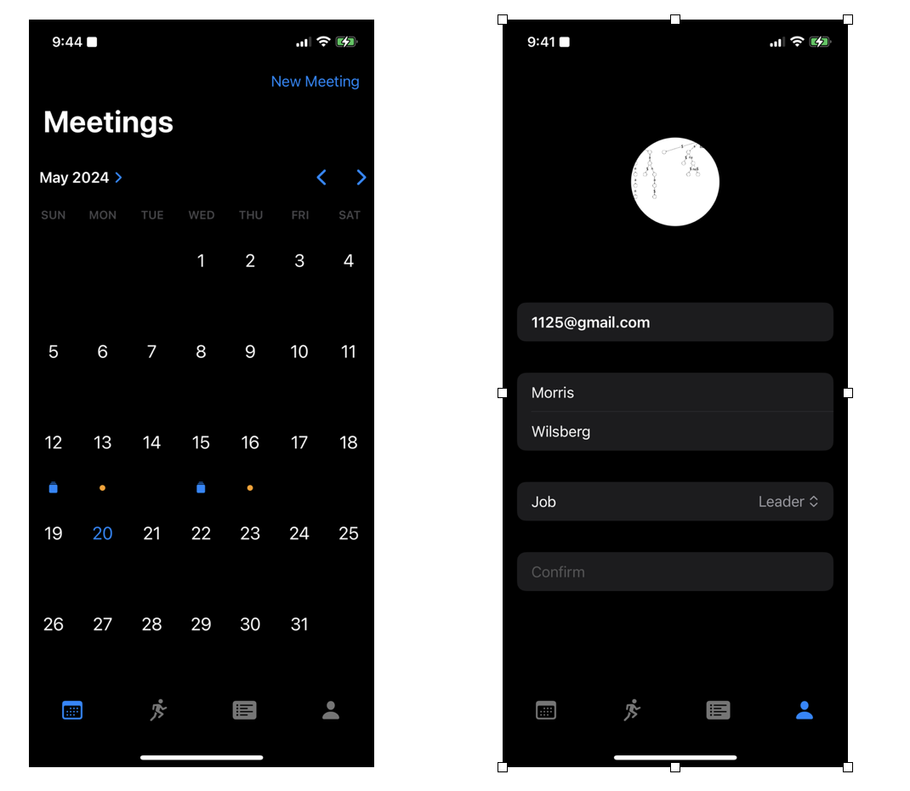
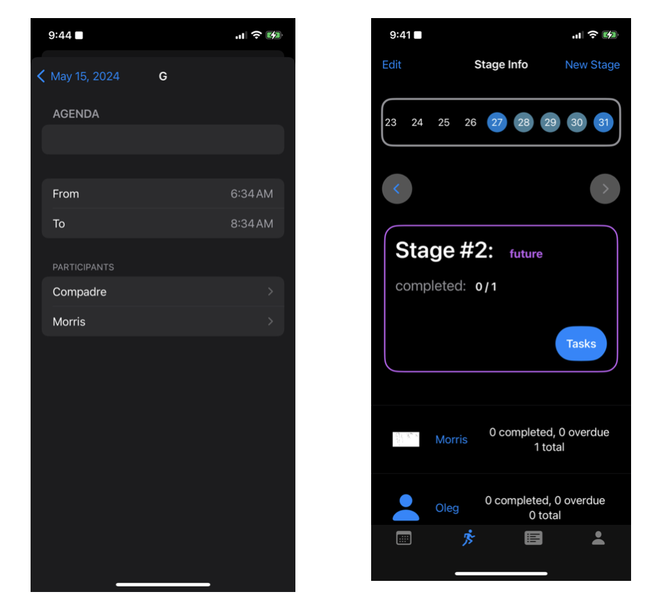

# Менеджер задач для 

Основная функциональность:
 - Контролирование этапов (спринтов)
 - Добавление, редактирование, удаление отдельных задач
 - Профиль разработчика
 - Календарь задач
 - Поддержка английского и русского языков
 - Поддержка темной и светлой темы

Сделано как проект для курса облачных технологий СПБГУ

### Некоторые скриншоты:

#### Календарь и Профиль:

#### Экран редактирование и экран этапов:

[Полная спецификация](Specification.pdf), включая цели проекта, UML-диаграммы и аргументирование выбора тех или иных технологий 
